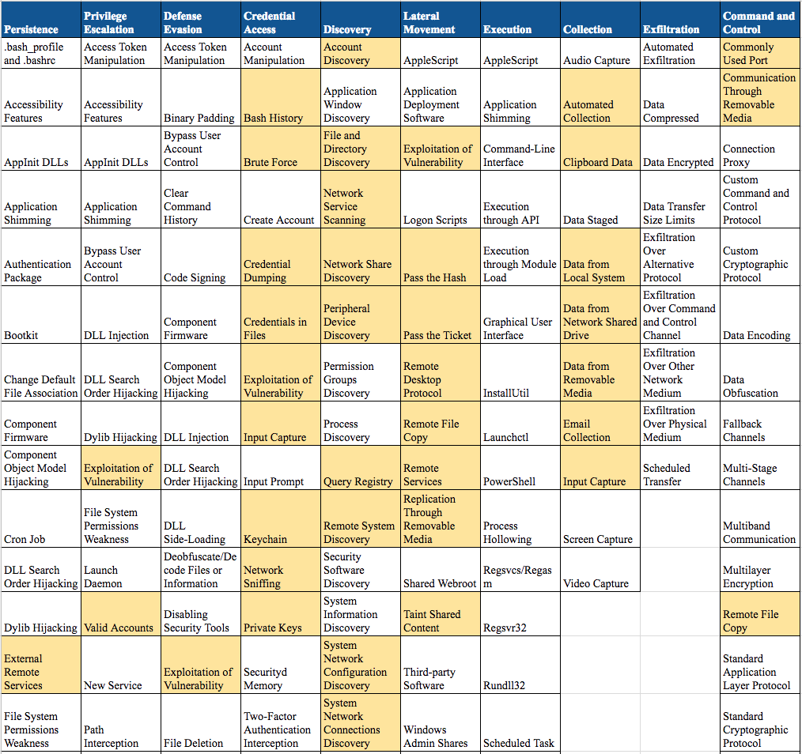
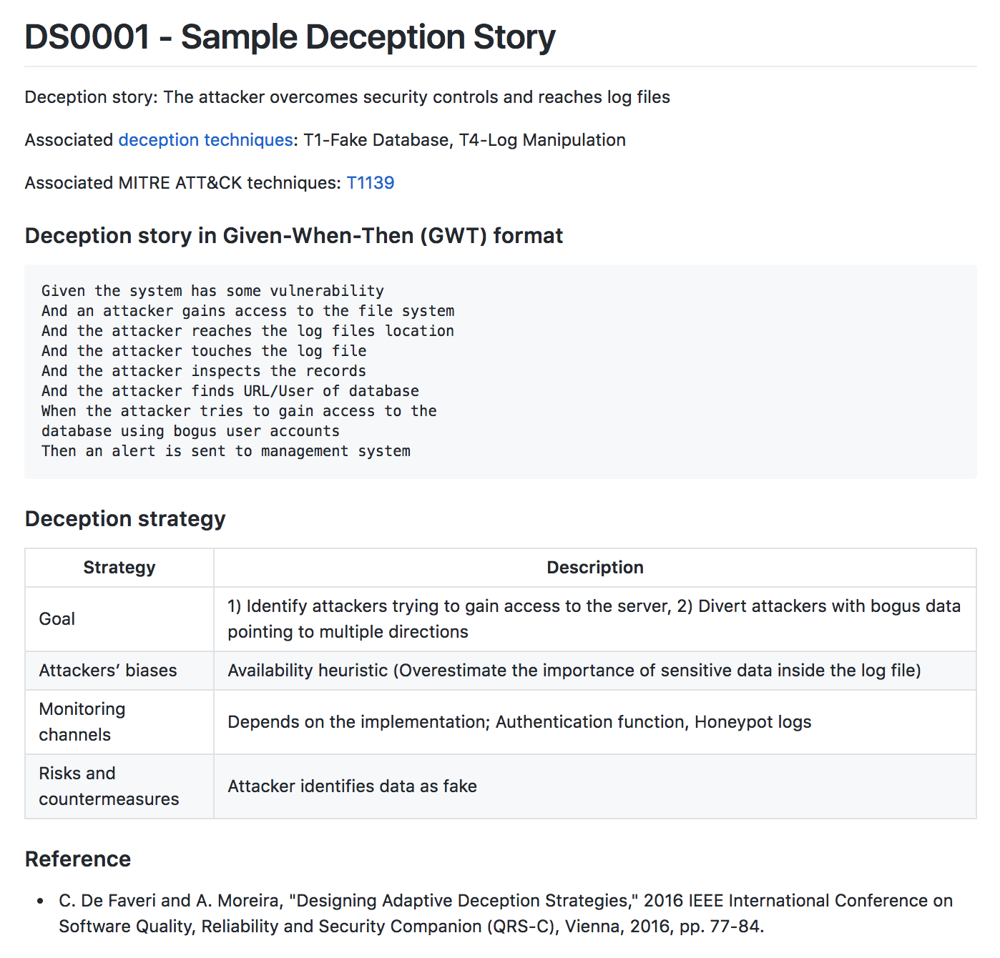

# Deception-as-Detection
Deception based detection techniques mapped to the MITRE’s Adversarial Tactics, Techniques, and Common Knowledge ([ATT&CK™](https://attack.mitre.org)):

* ### [Windows Technique Matrix](Windows-matrix.md)
* ### [Linux Technique Matrix](Linux-matrix.md)
* ### [Mac Technique Matrix](Mac-matrix.md)

## :notebook_with_decorative_cover: Deception Stories 
A [sample deception story](Deception_stories/DS0001.md) is created as a reference. More deception stories will be added soon. Stay tuned!

## :honey_pot: A [Useful List](Useful_resources.md) of Honey{*} Resources

## TODO
- [ ] Complete other techniques
- [ ] Add more deception stories
- [ ] Add Cloud based deception stories
